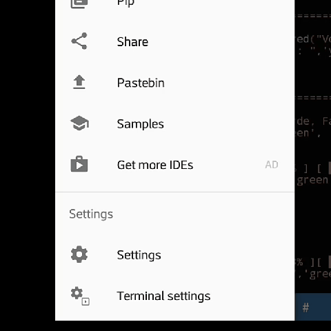

[![MLauncher Updates in All Languages [PT, EN]](https://github.com/MatheusTGamerPro/MLauncher_MCinaBox_Manager/actions/workflows/%5B%20MLauncher_Run_Code%20%5D.yml/badge.svg)](https://github.com/MatheusTGamerPro/MLauncher_MCinaBox_Manager/actions/workflows/%5B%20MLauncher_Run_Code%20%5D.yml)

# ⚠️ | MLauncher - MCinaBox Manager
Gerenciador e Organizador com muitas funções inclusas funcionando para MCinabox, instale OptFine, Otimizador, Limpeza e entre outras coisas do Gerenciador! Disponível em PT-BR e EN-US mais em breve..

# 🇺🇸 | Set-Language
🇺🇸 • **Please translate the page into your native language for a better experience!**

🇪🇸 • **¡Traduzca la página a su idioma nativo para una mejor experiencia!**

🇺🇸 • **About the Code:** For the time being the Code is in the developed Language: **PT-BR**,**EN-US**,
 The code translation will be done for everyone to use without problems!

🇪🇸 • **Acerca del Código:** Por el momento, el Código está en el Idioma desarrollado: **PT-BR**,**EN-US**,
  ¡La traducción del código se hará para que todos la utilicen sin problemas!

# ❗ | Como Funciona?
Você poderá executar um gerenciador com funções exclusivas e programadas
Para funcionar dentro do MCinaBox, nele você pode baixar o Próprio MCinaBox
Funcionando em todas as arquiteturas **x32** e **x64**, limpe os logs de registros utilizando ele
Otimize o MCinaBox utilizando o nosso RAMBoost integrado (Testes), veja informações de seu dispositivo
Utilizando o script e bibliotecas dentro do Código e entre outras funções.

# 📊 | Bibliotecas
As bíbliotecas nesse código é realmente muito importante
Caso a contrário o seu Código ficará travado em uma parte. Abaixo terá algumas das
Listas das bibliotecas utilizadas, e que você poderá instalar utilizando o **PIP**:

**Módulos:**

**pip install wget**

**pip install termcolor**

**pip install py-cpuinfo**

**pip install psutil**

Estes são os módulos mais necessários que devem ser importados e instalados
Dentro do código, você poderá executa-lo pelo app da GooglePlay: **PyDroid3**

# 📱 | Como Utilizar no Android
Nessa etapa você precisará prestar bastante atenção!
O código foi produzido totalmente pelo Android, ou seja, você deve executa-lo por um android
Então para que isso seja possível, estou trazendo aqui um Passo a Passo a vocês, vem comigo!
**Nota:** Você também pode executar o Código pelo Termux instale ele por aqui:
[Termux_Download](https://cdn.down-apk.com/com.termux/Termux_0.117_apkcombo.com.apk?ecp=Y29tLnRlcm11eC8wLjExNy8xMTcuNDkxZjIwN2UyODlhYzA1YmNiMzljYTQzNmI1MjE4ZjZhZTgwMWRiZC5hcGs=&iat=1634663989&sig=efb7ba7619370b2e26d0e4f5683b26a9&size=85749239&from=cf&version=latest)

**Passo 1/5**: Primeiramente Acesse a GooglePlay e Instale o App: [PyDroid3 - Download](https://play.google.com/store/apps/details?id=ru.iiec.pydroid3)

**Passo 2/5**: Entre e Aguarde o App instalar, Após isso, Pressione os três botões deitados

**Passo 3/5**: Vá em "Terminal", após isso,digite os seguintes comandos abaixo:

**Nota** = Digite um Comando de Cada Vez, e aguarde a instalação.

Comando 1: **pip install termcolor**

Comando 2: **pip install psutil**

Comando 3: **pip install cpuinfo**

Comando 4: **pip install wget**

Após fazer os seguintes comandos, você percebe que cada comandos irá iniciar uma instalação,
Significando que as Bibliotecas estão sendo instaladas! Após isso, você pode abrir o seu código **py**
Dentro do [PyDroid 3](https://play.google.com/store/apps/details?id=ru.iiec.pydroid3), caso estiver dando erro de algum módulo não instalado,
Vá até o Terminal novamente e execute o **pip install {nome do módulo}**, espero que tenha entendido!

# ⭐ | Alterar Tema do Código no Terminal (PyDroid)

Para deixar o Código mais **"bonito"** de se visualizar siga os passos abaixo!

Após Isso o seu Terminal ficará com a coloração do Linux, deixando o código
Mais confortável de visualizar a coloração (Termcolor), é recomendavel que você faça isso.

# 💡 | Créditos / Aviso Legal
Por Favor, NÃO remova os créditos que estão presentes no Código!
Caso você for fazer uma Fork, mencione os Créditos Abaixo:

🇧🇷 • Créditos ao Criador: **MatheusTGamerPro**

🇺🇸 • Credits of Developer: **MatheusTGamerPro**

# 🛡️ | Sobre o MCinaBox
O MCinaBox é um Launcher de Minecraft Java edition no Android possibitando de o usuário
Jogar o game dentro de seu dispositivo, o Manager foi desenvolvido para gerenciar e organizar o lançador
Os criadores originais do MCinaBox estará Abaixo:

Site Oficial do MCinaBox: [AOF-MCinaBox](https://github.com/AOF-Dev/MCinaBox)

⬇️**Developers**⬇️
- [x] **LongJunyu2**

- [x] **CosineMath**

- [x] **Iscle**

Também contém Outros Contribuidores do Launcher!
O MCinaBox no momento não contem novas atualizações, Mais em breve poderei criar uma Fork
Para um novo desenvolvimento do MCinaBox!

# ⚒️ | Funções do Gerenciador
**Todas as funções Atualmente adicionadas no código.**
- [x] Limpador de Logs
- [x] Instalador do MCinaBox for x32 e x64
- [ ] Suporte para PojavLaucher (Em Testes!)
- [x] Gerenciador de Arquitetura
- [ ] Otimizador de FPS (Produzindo, em Testes)
- [x] Gerenciador de Memória RAM
- [ ] Instalador de OptiFine (não implementado)
- [ ] Instalador de Forge, LabyMod, Clients (breve)
- [ ] Instador de Mods
- [x] Execuçao do código pelo Android: [Download](https://play.google.com/store/apps/details?id=ru.iiec.pydroid3)

# ✔️ | Versões Atuais e Futuras
**Versões em lançamento e lançadas**
- [x] 1.0
- [x] 1.5.0
- [x] 1.5.1
- [ ] 2.0 (Otimizada, em lançamento...)
- [ ] 2.5 (Otimizada, em Lançamento...)
- [ ] 3.0 (...)
# 🔑 | Componentes e Bibliotecas

- [Psutil](https://pypi.org/project/psutil/) - Cross-platform lib for process and system monitoring in Python.

- [Wget](https://pypi.org/project/wget/) - pure python download utility

- Termcolor - simple termcolor wrapper

- [cpuinfo](https://pypi.org/project/py-cpuinfo/) - Get CPU info with pure Python 2 & 3

- [requests](https://pypi.org/project/requests/) - Python HTTP for Humans.
